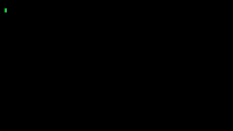

# macOS Matrix Screen Saver



This is a macOS screen saver based on the iconic rain of characters and symbols known from the movie The Matrix.

## Homebrew install (tap not live yet)

The local [tap payload](Homebrew/README.md) is prepared, but the public tap is
unconfigured and **not live**. The commands below are templates, not working
installation commands until a tap owner publishes it. Replace the placeholder
with the chosen tap before running them:

```bash
TAP="YOUR_OWNER/YOUR_TAP" # unconfigured placeholder
```

The cask supports Apple Silicon (ARM64) and macOS 15 (Sequoia) or newer.
It uses deprecated hooks supported by ordinary Homebrew 7.0.7; developer-mode
installs reject those hooks. Future Homebrew compatibility is not guaranteed.

**Security:** installation removes quarantine from the checksum-verified staged
bundle. This bypasses Gatekeeper quarantine checks; it does not make the bundle
notarized or Apple-approved. Install only if you trust the release publisher.

### Fresh install

```bash
brew install --cask "$TAP/matrix-screen-saver"
```

After a successful first install, Wallpaper settings opens. You must manually select
**MatrixScreenSaver** under **Screen Saver**. If settings cannot open, navigate to
**System Settings > Wallpaper > Screen Saver** yourself. The cask never selects
the saver automatically.

### Migrate a manual installation

An existing bundle at Homebrew's screen saver destination is not silently deleted.
An unforced install fails with migration guidance. To explicitly allow Homebrew
to replace that saver bundle:

```bash
brew install --cask --force "$TAP/matrix-screen-saver"
```

This replaces the bundle and retains saved options in `dev.patsch.MatrixScreenSaver`.
Forced migration also opens settings once for manual selection. A custom Homebrew
screen saver destination is honored; other copies are not removed.

### Upgrade

```bash
brew upgrade --cask "$TAP/matrix-screen-saver"
```

Managed upgrades do not show the manual-install conflict warning. Managed
upgrades do not open settings; reinstalls also suppress initial setup.
Successful installs and upgrades print one invitation without opening a browser:

> There is no spoon. There is coffee: https://www.buymeacoffee.com/yesman82

### Ordinary uninstall

```bash
brew uninstall --cask "$TAP/matrix-screen-saver"
```

Homebrew removes its saver bundle but retains saved options. Migration, upgrade,
and ordinary uninstall never rewrite or delete the preferences domain.

## Manual quick install (alternative)

This route is not Homebrew-managed. To switch later, use the explicit migration
command above. The quarantine command below bypasses Gatekeeper quarantine checks;
it does not make the bundle notarized or Apple-approved. The replacement command
deletes the existing bundle, not its saved options. Trust the publisher before
running these commands.

1. Open the [latest release](https://github.com/patrickschaper/matrixScreenSaver/releases/latest) and download the versioned `.zip` file from the release assets.
2. Double-click the downloaded `.zip` file to extract `MatrixScreenSaver.saver`.
3. In Terminal, run the following commands from the directory that contains the extracted `MatrixScreenSaver.saver` file:

   ```bash
   xattr -dr com.apple.quarantine MatrixScreenSaver.saver
   mkdir -p "$HOME/Library/Screen Savers"
   rm -rf "$HOME/Library/Screen Savers/MatrixScreenSaver.saver"
   ditto MatrixScreenSaver.saver "$HOME/Library/Screen Savers/MatrixScreenSaver.saver"
   open "x-apple.systempreferences:com.apple.Wallpaper-Settings.extension"
   ```

4. In the opened Wallpaper settings, switch to **Screen Saver** and select **MatrixScreenSaver**.
5. Enjoy and donate — so I can invest in a developer license for signing the screen saver and make it installable with a double-click (Thanks Apple 😐)<br>
   <a href="https://www.buymeacoffee.com/yesman82"></a><br>
   

## Options

The saver exposes a native **Options…** sheet. The values are stored with `ScreenSaverDefaults`.

| Option | Description | Default |
| --- | --- | --- |
| Number scene | Show the startup number scene before continuous rain. | On |
| Twinkle | Turn on/off the twinkling effect. | On |
| Diffuse | Turn on/off the glow effect. | On |
| Character size | Set the character cell width and height in pixels.<br>Example pairs: 8 x 15, 9 x 17, 10 x 19, 11 x 21, 12 x 23, and 13 x 24. | 9 x 17 |
| Rain density | Set the factor for the density of rain drops. A positive number. | 1.0 |
| Frame rate | Set the frame rate per second. A positive number less than or equal to 1000. | 25 |
| Error rate | Set the factor for the rate of character changes. A non-negative number. | 1.0 |
| Characters | Restrict rain glyphs to a custom set (e.g. ATGC). Leave empty for the default. | *(empty)* |
| Neo message scene | Show the Neo message intro before the main scene. | On |
| Neo message speed | Typing and pause speed multiplier for the Neo message intro. A positive number. | 1.0 |
| Neo message lines | Lines typed during the Neo message intro. Between 1 and 10 lines, up to 256 characters each. | The 4 classic lines |
| Scan lines intensity | Opacity of the CRT scan line overlay (0 = off, 100 = fully opaque). | 25 |
| Scan lines vertical | Orientation of the scan line overlay (vertical or horizontal). | On (vertical) |

## Development

### Current state

- Native Swift/AppKit screen saver bundle
- Edge-to-edge full-screen saver output, with terminal-style chrome kept in the preview host
- In-process renderer for `rain-forever` with an optional upstream `number` intro
- Native **Options…** sheet for Number scene, Twinkle, Diffuse, Character size, Rain density, Frame rate, Error rate, Characters, Neo message scene/speed/lines, and Scan lines
- Preview app for fast iteration without reinstalling

### Repository layout

- `Sources/MatrixScreenSaver/MatrixScreenSaverView.swift` - screen saver view, layout, drawing, and option wiring
- `Sources/MatrixScreenSaver/NativeMatrixRenderer.swift` - native Matrix scene renderer
- `Sources/MatrixScreenSaver/MatrixScreenSaverOptions.swift` - options model and native configure sheet
- `Sources/MatrixScreenSaver/TerminalSupport.swift` - small shared terminal types used by the active renderer
- `Scripts/install-saver.sh` - shared ditto-based installer used by local installs
- `Tools/PreviewHost.swift` - local preview host used by `./preview.sh`
- `Resources/Info.plist` - bundle metadata

### Requirements

- macOS
- Xcode Command Line Tools with `swiftc`

Full Xcode is not required.

### Build

```bash
./build.sh
```

This creates the screen saver bundle:

```text
build/MatrixScreenSaver.saver
```

`build.sh` reads the current version from `./VERSION` and writes it into the saver bundle metadata.

### Test

```bash
./tests.sh
```

Compiles and runs the test suite using `swiftc`. No Xcode required — Command Line Tools are sufficient.

### Preview without installing

```bash
./preview.sh
```

This rebuilds the bundle, compiles the preview host, and opens the saver in a normal macOS window for quick iteration.

### Install

```bash
./install.sh
```

`install.sh`:

1. rebuilds the saver bundle
2. strips quarantine from the source bundle and copies it to `~/Library/Screen Savers/MatrixScreenSaver.saver`
3. verifies the installed executable matches the build output
4. stops running `ScreenSaverEngine` / `legacyScreenSaver` processes so macOS reloads the updated bundle

After installing:

1. open **System Settings > Wallpaper > Screen saver...**
2. select **MatrixScreenSaver**

To relaunch the screen saver host manually:

```bash
open -a ScreenSaverEngine
```

### Origin

This project started as an attempt to wrap `cxxmatrix` inside a macOS screen saver.

The current implementation is based on the upstream [`akinomyoga/cxxmatrix`](https://github.com/akinomyoga/cxxmatrix) project and keeps its look and scene behavior, but it no longer launches an external terminal process at runtime. The active saver is a native in-process Swift/AppKit renderer because `ScreenSaverEngine` did not reliably render the external terminal stream.

The active renderer currently ports `rain-forever` and can optionally start with the upstream `number` intro.
