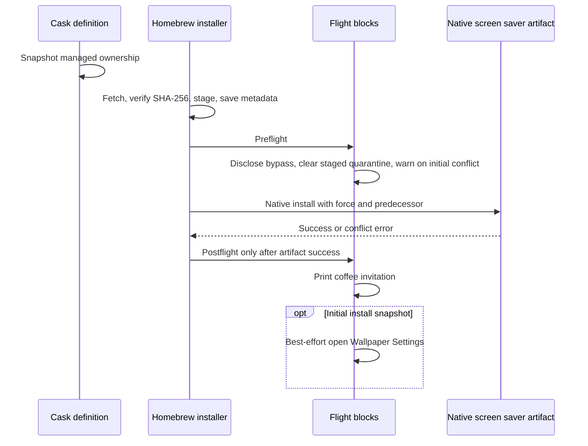
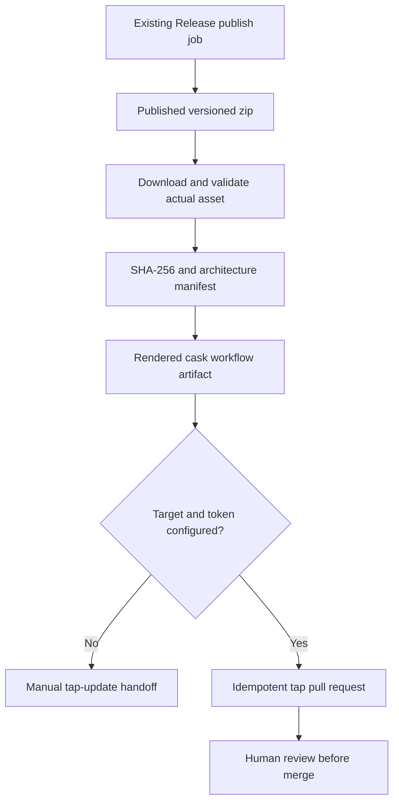

# Homebrew Tap Distribution - Plan

## Goal Capsule

- **Objective:** Users can install, migrate, upgrade, and remove MatrixScreenSaver through Homebrew without losing their saved options.
- **Means:** An own-tap cask using Homebrew's native screen saver artifact (KTD1).
- **Authority:** Product requirements govern behavior; technical decisions govern mechanisms; repository instructions and explicit user permissions govern external and git operations.
- **Execution profile:** Implement and verify repository-local packaging, release output, and documentation. Never install or uninstall on the user's machine; integration verification belongs in disposable CI environments.
- **Stop conditions:** Stop if Homebrew removes the required hook capability, if a settled decision proves incompatible, or before publishing to an unselected tap or provisioning credentials.
- **Landing:** The caller owns implementation and any subsequent shipping. Branch creation, commit, push, PR, merge, and workflow execution require explicit permission under `AGENTS.md`; this plan supplies none.

---

## Product Contract

### Summary

Add an own-tap Homebrew distribution path, including safe manual-install migration, first-install setup guidance, upgrade output, and reproducible release metadata.
Prepare everything locally without selecting or creating the external tap repository.

### Problem Frame

The current README requires users to strip quarantine and replace the bundle manually.
That path gives users no package-manager ownership for upgrades or removal and can obscure the security bypass and existing-install conflict.

### Requirements

**Packaging and security**

- R1. Use the native `screen_saver` artifact so Homebrew owns bundle placement, upgrades, rollback, and uninstall.
- R2. Preflight removes `com.apple.quarantine` recursively from the staged saver only, with an explicit Gatekeeper-bypass disclosure in terminal guidance and README.
- R3. Pin each published cask to a release version, immutable versioned download URL, and the downloaded archive's SHA-256; never use `:no_check` or a floating latest URL.

**Migration and lifecycle**

- R4. Detect an occupied native destination on a first Homebrew install and provide actionable `brew install --cask --force <fully-qualified-cask>` migration guidance without deleting it in a hook.
- R5. Only the user's explicit `--force` invocation permits Homebrew to replace the conflicting manual bundle; preserve preferences during migration, upgrade, and ordinary uninstall.
- R6. Do not classify a Homebrew-managed upgrade as a manual-install conflict.
- R7. Open Wallpaper Settings after a successful initial Homebrew install, including a forced migration, but not an upgrade; users select MatrixScreenSaver themselves.

**Output and documentation**

- R8. Print a short nerdy coffee invitation with `https://www.buymeacoffee.com/yesman82` after successful install and upgrade, without opening that URL automatically.
- R9. README documents fresh install, migration, upgrade, ordinary uninstall, settings selection, preference retention, and the quarantine/security bypass.

**Release integration and authority**

- R10. Release automation produces the version and SHA-256 needed to update the tap, preferably as a tap PR once the user configures the target and authorized credentials.
- R11. Do not create an external repository or secrets, select a tap name on the user's behalf, or modify the user's installed saver during this work.

### Key Decisions

- **Native ownership** (session-settled: user-approved — chosen over a custom installer script: Homebrew must manage upgrades and uninstall). Governs R1.
- **Explicit replacement** (session-settled: user-approved — chosen over silent hook deletion: existing installs must require opt-in replacement). Governs R4, R5.
- **Manual selection and initial-only settings** (session-settled: user-approved — chosen over automatic saver selection and opening settings on upgrades: setup stays user-controlled and upgrades stay unobtrusive). Governs R7.
- **Coffee output on both successful lifecycle operations** is a user directive, not a settlement with a supplied rejected alternative. The implementation challenge is noisy or promotional output: keep it one short invitation, never launch a browser, and retain R8 as directed.

### Acceptance Examples

- AE1. Covers R1, R2, R7, R8. With no Homebrew receipt or destination bundle, installation removes staged quarantine, installs the native artifact, prints the invitation, and opens settings once.
- AE2. Covers R4, R5. With a manual bundle at the destination, an unforced install prints migration guidance and fails through Homebrew's native conflict guard; the manual executable and saved options remain unchanged.
- AE3. Covers R1, R5, R7, R8. Retrying that migration with explicit `--force` replaces only the destination artifact, retains saved options, prints the invitation, and opens settings.
- AE4. Covers R3, R6, R7, R8. An existing managed version upgrades to the next pinned version with no migration warning or settings launch and with the coffee invitation.
- AE5. Covers R1, R5. Ordinary uninstall removes Homebrew's saver artifact while leaving the options domain untouched.

### Scope Boundaries

- No renderer or native options UI changes, no custom installer artifact, no automatic saver selection, and no preference deletion or `zap` stanza.
- Preserve the current manual-install route as an alternative; distinguish it from package-managed maintenance.

#### Deferred to Follow-Up Work

- User selection/provisioning of the actual tap and cross-repository credentials; publication must wait for that choice.
- Signing/notarization and universal Intel/Apple Silicon releases. This work must not promise unsupported architectures.
- Migration away from deprecated hooks when Homebrew supports the required conditional settings launch without changing R7.

---

## Planning Contract

### Key Technical Decisions

- KTD1. **Prepare a self-contained tap payload locally.** Keep a publishable cask at `Homebrew/Casks/matrix-screen-saver.rb` in this repository; its eventual tap-relative location is `Casks/matrix-screen-saver.rb`. Use the native artifact and do not call `Scripts/install-saver.sh`. (session-settled: user-approved — chosen over a custom installer artifact: preserve Homebrew ownership). Implements R1 and cites the Product Contract's native-ownership decision.
- KTD2. **Use legacy Ruby flight blocks only for the required conditional behavior.** Homebrew 7.0.7 invokes `AbstractFlightBlock#abstract_phase` directly and `DSL::Base#system_command` uses `SystemCommand.run!`, without `run_cask_sandbox`. Consequently the postflight settings launch is outside Homebrew's new install-step sandbox. These blocks are deprecated, not removed in ordinary third-party use; developer mode raises `MethodDeprecatedError`. Disclose that limitation and isolate any justified style exception to `Cask/InstallSteps`, never disable all audit checks. The modern declarative steps do not establish an equivalent first-install-only settings action in the inspected code. Do not pretend a clean unmodified developer-mode audit is possible with this design. Implements R2, R7, R8.
- KTD3. **Snapshot managed-install state before staging.** Capture whether the cask has installed metadata when its definition is evaluated, and share that immutable value with the flight-block closures. Do not query `cask.installed?` inside preflight or postflight: `Installer#stage` calls `save_caskfile` before artifacts run, making it true even on fresh install. Upgrade loads the successor before `start_upgrade` moves old artifacts and metadata; therefore the snapshot records managed ownership before that transition. A reinstall should also suppress setup if a receipt was present before staging. No durable first-install marker, global variable, or preference write is needed. Implements R4, R6, R7.
- KTD4. **Warn in preflight; let the native artifact enforce force semantics.** Derive destination from the screen saver artifact's resolved target, including a custom `screen_saverdir`, and treat any occupied path, including a broken symlink, as occupied. For a first install print R4 guidance, then continue to the artifact. `Moved#move` rejects occupancy without force and performs replacement with force. Flight blocks receive neither force nor predecessor in their evaluation context, so a hook must not raise an unconditional conflict exception or parse global CLI arguments. Implements R4, R5, R6.
- KTD5. **Preserve the bundle identity and all defaults.** Keep `dev.patsch.MatrixScreenSaver` unchanged and never read, rewrite, or delete preference files in cask hooks. `MatrixScreenSaverView` creates `ScreenSaverDefaults` from that identifier. Ordinary native removal has no preference cleanup. Implements R5.
- KTD6. **Use successful postflight output, with best-effort settings launch.** Print R8 once from postflight rather than relying exclusively on caveats being shown by upgrades. Proposed copy: “There is no spoon. There is coffee: https://www.buymeacoffee.com/yesman82”. Print manual selection guidance and invoke the existing Wallpaper Settings URL only when KTD3 indicates initial install. A settings-launch failure must warn with the manual navigation path rather than fail or roll back an otherwise successful installation. Implements R7, R8.
- KTD7. **Produce an offline-consumable release handoff before optional tap automation.** Extend the existing publish path, after the release asset exists, to generate an updated cask and a compact manifest from the actual downloaded release bytes. Include version, asset URL, SHA-256, architecture, and provenance. Reruns retrieve the existing immutable asset rather than rebuilding it. Default to a workflow artifact and job summary with manual tap-update instructions. An optional target plus separately configured token enables an idempotent tap PR, never direct default-branch pushes or automatic merge. The source-repo `GITHUB_TOKEN` alone is not cross-repository authorization. Implements R3, R10, R11.

### Assumptions

- Local preparation under `Homebrew/` is sufficient for this delivery; selecting the external tap remains user-owned. README must mark the command's tap value as unconfigured, not present `patrickschaper/homebrew-tap` as real.
- `matrix-screen-saver` is the proposed cask token, pending publication naming review.
- Initial compatibility is ordinary Homebrew 7.0.7 on Apple Silicon with macOS 15 or newer, not developer-mode hook execution. The published executable is ARM64 with a Mach-O minimum macOS version of 15.0, so constrain the cask to ARM64 and macOS Sequoia or newer; broadening compatibility is separate work.
- Failed installation must not print a success invitation or launch settings. Reinstall suppression is an inferred extension of the initial-only setup rule.

### High-Level Technical Design

**Lifecycle and branching (KTD3, KTD4)**

| State before staging | Native target occupied | Preflight action | Native artifact action | Postflight settings |
|---|---|---|---|---|
| No managed receipt | No | R2 disclosure and staged quarantine removal | Install | Open once |
| No managed receipt | Yes, no force | R4 migration warning and R2 action | Fail without replacing target | Never reached |
| No managed receipt | Yes, explicit force | R4 migration warning and R2 action | Replace target | Open once |
| Managed receipt, upgrade | Removed by upgrade preparation | R2 action, no migration warning | Install successor with predecessor | Do not open |
| Managed receipt, reinstall | Removed by reinstall preparation | R2 action, no migration warning | Reinstall | Do not open |

**Hook protocol**

**Release data flow and component boundary**

### Risks and Dependencies

- **Deprecated hooks are a real compatibility debt.** KTD2 is currently feasible for ordinary use but not developer-mode installs. Explicitly test and document that difference; re-check upstream before claiming future Homebrew compatibility. Do not request a global sandbox opt-out.
- **Gatekeeper bypass changes the trust boundary.** Removing quarantine is not notarization, malware verification, or an Apple security approval. Limit the operation to the checksum-verified staged bundle and disclose the residual risk before it runs.
- **A GUI operation can fail in CI or a headless session.** KTD6 keeps the installed saver usable with manual setup instructions; no automatic selection or restart is added.
- **Publication is externally gated.** An unselected tap name and absent credentials do not block local units, but do block advertising a live tap or producing a real tap PR.
- **Compatibility is narrower than generic macOS.** The published `0.2.0.zip` contains a thin ARM64 Mach-O targeting macOS 15.0 or newer. Do not offer that cask on Intel or older macOS, or claim the existing build is universal.

### System-Wide Impact

Homebrew replaces bundle files and manages cask receipts; saver options remain in the existing defaults domain.
Migration warnings operate before any native replacement. Quarantine failure must abort before artifact installation, while settings-launch failure must not undo installation.
Tap publication adds a credential boundary separate from the current release repository and its token.

### Sources and Research

- Homebrew 7.0.7 installed checkout commit `8e858db5584704dcd469b8e826228c0d5a5a94f6`; GitHub tag sources match the legacy block behavior: [flight block execution](https://github.com/Homebrew/brew/blob/7.0.7/Library/Homebrew/cask/artifact/abstract_flight_block.rb), [hook registration/deprecation](https://github.com/Homebrew/brew/blob/7.0.7/Library/Homebrew/cask/dsl.rb), [command invocation](https://github.com/Homebrew/brew/blob/7.0.7/Library/Homebrew/cask/dsl/base.rb).
- [Native screen saver](https://github.com/Homebrew/brew/blob/7.0.7/Library/Homebrew/cask/artifact/screen_saver.rb), [native move/force behavior](https://github.com/Homebrew/brew/blob/7.0.7/Library/Homebrew/cask/artifact/moved.rb), [stage and saved metadata](https://github.com/Homebrew/brew/blob/7.0.7/Library/Homebrew/cask/installer.rb), [upgrade ordering](https://github.com/Homebrew/brew/blob/7.0.7/Library/Homebrew/cask/upgrade.rb), [sandboxed declarative steps](https://github.com/Homebrew/brew/blob/7.0.7/Library/Homebrew/cask/artifact/install_steps.rb), [deprecation exceptions](https://github.com/Homebrew/brew/blob/7.0.7/Library/Homebrew/utils/output.rb), [install-step style cop](https://github.com/Homebrew/brew/blob/7.0.7/Library/Homebrew/rubocops/cask/install_steps.rb).
- Latest published release inspected: [0.2.0.zip](https://github.com/patrickschaper/matrixScreenSaver/releases/download/0.2.0/0.2.0.zip), SHA-256 `7a60c8ec2855a2df4cb008da7f79ea9e8526385897e3048bb53bb42421e07acd`. Downloaded bytes match GitHub's asset digest. Archive root is `MatrixScreenSaver.saver`; executable CPU type is ARM64 (`0x0100000c`) and its Mach-O minimum macOS version is 15.0.0. Do not infer future archive layout from this one release.
- Repository patterns: `.github/workflows/release.yml` publishes `${version}.zip` from `VERSION`, skips creation when a release exists, and currently dispatches preparation from `development`; `build.sh` ad-hoc signs without producing a universal binary; `README.md` already uses the Wallpaper Settings URL; `Resources/Info.plist` and `Sources/MatrixScreenSaver/MatrixScreenSaverView.swift` establish preference identity.

---

## Implementation Units

### U1. Native cask and lifecycle regression coverage

**Goal:** Deliver a self-contained publishable cask with proven migration and setup gating.

**Requirements:** R1-R8, R11; AE1-AE5. **Dependencies:** None.

**Files:** Create `Homebrew/Casks/matrix-screen-saver.rb`, `Homebrew/README.md`, `Tests/Homebrew/cask_lifecycle_test.rb`, and `Tests/Homebrew/support/fake_cask_dsl.rb`.

**Approach:**
1. Implement KTD1-KTD6 in the self-contained cask, seeded from the verified published release in Sources and Research.
2. Keep metadata evaluation read-only, preserve closure state per invocation, and use artifact-derived source and target paths rather than assumed destinations.
3. Create fixture-backed Ruby tests with temporary staged and target bundles, mocked command execution and output capture; explicitly model metadata becoming installed between definition evaluation and preflight.

**Patterns to follow:** Native artifact lifecycle from the cited Homebrew sources; the existing README settings URL and bundle identifier. Do not reuse the destructive local installer.

**Execution note:** Prove the snapshot bug and force delegation with fixture tests before relying on hook behavior; no real saver operations on the user's machine.

**Test scenarios:**
- Covers AE1. A fresh definition sees no receipt; staging creates metadata before preflight; installation still counts as initial and postflight opens settings once.
- Covers AE2. A manual target and no prior receipt emit a fully qualified `--force` command; hooks never remove the target; native unforced installation fails and preferences remain byte-identical.
- Covers AE3. The same fixture with native force enabled replaces the bundle and retains preferences; settings open once.
- Covers AE4. A successor definition observes an existing receipt before old metadata is moved aside; upgrade emits no conflict warning and no settings launch, but prints the exact coffee URL.
- Covers AE5. Native uninstall has no preference cleanup artifact or defaults writes.
- A custom screen saver directory is honored for conflict detection; broken symlinks are recognized as occupied without following them for deletion.
- Missing staged source or quarantine command failure aborts before native placement and success output.
- Settings launch failure emits manual navigation guidance without failing the installation.
- Reinstall with prior managed metadata suppresses settings; evaluating the cask for information alone launches nothing and changes nothing.
- Cask dependencies reject Intel and macOS older than 15 before attempting to install the published binary.

**Verification:** Fixture tests prove AE1-AE5, command bounds, and output counts; cask syntax and metadata load under ordinary Homebrew 7.0.7.

### U2. Reproducible release-to-cask handoff

**Goal:** Generate tap-ready updates from the published asset without requiring an external repository.

**Requirements:** R3, R10, R11. **Dependencies:** U1.

**Files:** Modify `.github/workflows/release.yml`; create `Scripts/render-homebrew-release.py`, `Tests/Homebrew/release_metadata_test.py`, and fixture archives under `Tests/Homebrew/fixtures/`.

**Approach:**
1. Implement KTD7 as a distinct post-publication handoff, preserving prepare/publish triggers and the current release naming scheme.
2. Validate release version, download bytes, archive source path, bundle version, supported architecture, and Mach-O minimum OS before rendering the cask from the local payload; never render a dependency floor lower than the binary's requirement.
3. Upload the cask and manifest as a workflow artifact and summarize the manual update. Add a disabled-by-default cross-tap PR path using an explicit target and separately configured credential; document configuration without provisioning it.
4. Limit that credential to the selected tap's contents and pull-request permissions, keep it in GitHub Actions secrets, and never expose it in logs or fork-PR tests. Validate target/version inputs and use argument-safe API calls rather than interpolating untrusted strings into workflow shell code.

**Patterns to follow:** Existing publish job's version and archive outputs; GitHub-native workflow artifacts and PR review. Do not duplicate version-bump or release-creation logic.

**Test scenarios:**
- Known fixture bytes generate the expected version, URL, architecture, and SHA-256, with no placeholders in the released cask.
- A rerun with an existing release consumes the existing published archive rather than a newly built zip.
- A missing asset, checksum/digest mismatch, bundle-version mismatch, invalid version, unsupported architecture, or unexpected saver path fails handoff generation without a tap PR.
- No tap configuration produces the complete manual artifact and an explicit unconfigured summary, with no external mutation.
- Configured mock target and token produce one update PR for the version; rerun reuses the matching branch/PR; no automatic merge occurs.
- A configured target without credentials fails only the optional tap-update path with recovery guidance; published releases remain available and the generated manual artifact remains retrievable.
- Fork-PR verification receives no publishing credential; malformed target input is rejected before an API request and captured logs contain no credential value.

**Verification:** Deterministic offline tests and workflow lint prove reproducibility and bounded permissions; CI produces a reviewable artifact from fixture assets without a real external PR.

### U3. User and maintainer documentation

**Goal:** Make Homebrew lifecycle commands and the trust decision understandable without repository knowledge.

**Requirements:** R2, R4-R11. **Dependencies:** U1, U2.

**Files:** Modify `README.md` and `Homebrew/README.md`; create `Tests/Homebrew/documentation_test.py`.

**Approach:** Document R9 using the actual generated cask token and a visibly unconfigured tap placeholder. Explain native force replacement and preference retention, the KTD2 compatibility debt, the exact coffee link, and the KTD7 maintainer handoff. Keep the manual path separate and add the same security disclosure to its quarantine instructions.

**Test scenarios:**
- Fresh, migrate-with-force, upgrade, and ordinary uninstall sections use a consistent token and tap placeholder; no illustrative tap is described as provisioned.
- The bypass disclosure states that quarantine removal bypasses Gatekeeper quarantine checks and does not make the bundle notarized or Apple-approved.
- Migration instructions describe replacement of the saver bundle and retention of settings; uninstall instructions do not recommend `--zap`.
- Settings instructions require manual selection and explain that upgrades do not open settings.
- Maintainer instructions separate generated artifacts from optional cross-repo credentials and human PR merge.

**Verification:** Documentation checks find all required sections and URLs; a reader can distinguish ready local artifacts from the still-unconfigured public tap.

### U4. Disposable Homebrew lifecycle integration

**Goal:** Verify native ownership and real hook ordering without touching the user's installation.

**Requirements:** R1-R8, R11; AE1-AE5. **Dependencies:** U1, U2, U3.

**Files:** Create `.github/workflows/homebrew-tests.yml`, `Tests/Homebrew/integration_lifecycle.sh`, and `Tests/Homebrew/support/integration_driver.rb`; extend `Homebrew/README.md` with verification and compatibility limits.

**Approach:** Use disposable macOS CI with fixture releases for two versions, an isolated test tap, and a temporary native destination. The Ruby integration driver loads actual Homebrew installer/upgrade classes and selectively intercepts `SystemCommand` only for the exact `/usr/bin/open` settings-launch call, recording counts and simulating failure. Pass through all native artifact, filesystem, download, and quarantine operations. Legacy flight blocks ignore the installer's supplied command object, so interception must cover their default command class; a PATH stub cannot replace this absolute executable. Use a sentinel preference file outside the artifact destination. Do not rely on changing HOME alone to isolate brew or defaults.

**Execution note:** Native lifecycle smoke proof is required in addition to Ruby mocks. CI must use ordinary mode for deprecated hook execution; preserve a separate expected-failure check showing developer mode rejects legacy stanzas rather than claiming universal audit compatibility.

**Test scenarios:**
- Covers AE1-AE5. Real native artifact install, conflict rejection, forced replacement, two-version upgrade, and uninstall produce the required target contents and retain the preference sentinel.
- Real preflight runs after stage metadata creation; the definition snapshot still distinguishes initial install from upgrade.
- The staged and installed saver have no quarantine attribute after successful install and upgrade.
- Upgrade executes the successor postflight exactly once; captured output includes R8 and contains no manual migration warning.
- A failing postflight settings command does not roll back native installation.
- Developer-mode loading fails for the known deprecation; ordinary-mode loading succeeds with the disclosed warning.

**Verification:** CI logs establish real native ownership and hook ordering, alongside fixture tests; no host-installed saver or real external tap is modified.

---

## Verification Contract

- Existing regression gates remain `./tests.sh` and `./build.sh`; these are execution-time checks, not planning actions.
- Add documented invocations for the new Ruby and Python suites, shell syntax checks, cask syntax checks, workflow lint, and the disposable integration job.
- Style and audit results must distinguish genuine defects from the narrow `Cask/InstallSteps` compatibility exception and developer-mode deprecation. Do not hide broader failures or claim an unqualified clean audit.
- Download verification must use the published archive bytes, not source hashes or a rebuilt bundle.
- Real install/upgrade/uninstall validation runs only in disposable CI or a separately authorized disposable environment. No local `brew install`, `brew uninstall`, saver installation, settings launch, or workflow trigger is authorized by this plan.
- External tap publication remains gated by the user's actual target and authorization; it is not a local verification prerequisite.

---

## Definition of Done

- U1-U4 satisfy their named test scenarios and AE1-AE5, with native lifecycle evidence beyond mocks.
- The cask and release handoff are self-contained, pinned, reproducible, and checksum-verified.
- README covers R9 and accurately labels tap publication as unconfigured until the user selects it.
- The hook deprecation, ARM64-only architecture, and macOS 15 minimum are explicit rather than silently treated as general Homebrew/macOS support.
- No production saver code, preference domain, user's installed saver, external repository, or secret is changed.
- Abandoned approaches and experimental code are removed from the implementation diff; unrelated `.serena/` files remain untouched.
