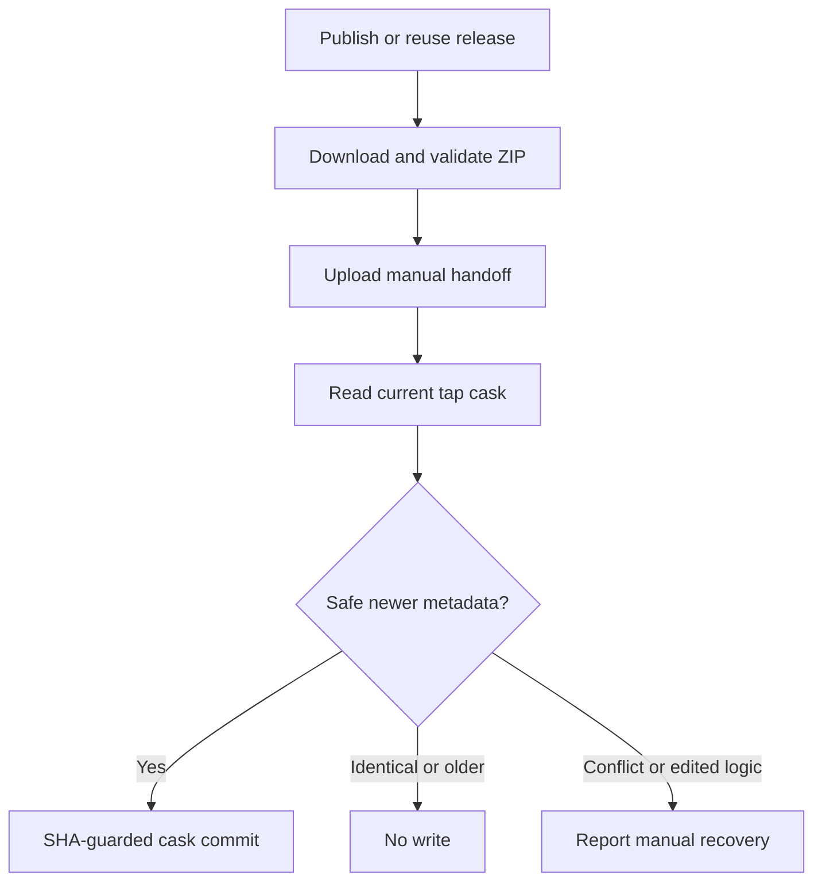

# Automatic Homebrew Tap Updates - Plan

## Goal Capsule

- **Objective:** Homebrew users can upgrade to newly published saver releases without waiting for a maintainer to merge a tap PR.
- **Means:** Guarded automatic publication from the existing release job (KTD1).
- **Authority:** User request and repository instructions override this plan.
- **Execution:** Local implementation and tests; LFG owns review and a new PR to development from the current feature branch.
- **Stop conditions:** No live tap writes, secret provisioning, release triggers, installed saver changes, force pushes, or PR merges during implementation.

---
## Product Contract

### Summary

Replace the optional tap PR with an automatic update of the published cask, enabled by the configured target and a dedicated credential.

### Problem Frame

The release workflow currently opens a tap PR requiring human review and merge. That delays Homebrew availability even after GitHub publishes the saver ZIP.

### Requirements

**Publication**
- R1. Each release published by the repository's Release workflow updates the configured tap without requiring a tap PR merge.
- R2. Use the existing published versioned ZIP and its validated SHA-256; retain the manual handoff artifact.

**Safety and operations**
- R3. Reject downgrades, conflicting same-version content, concurrent stale writes, and changes to cask content outside release metadata.
- R4. Missing credentials or tap API failure must not invalidate the published release; report recovery instructions visibly.
- R5. Document the dedicated fine-grained tap contents-write token and main-branch rollout requirement without exposing or repurposing credentials.

### Scope Boundaries

No runtime renderer or cask installation changes. No credential setup or live publication in this run. Releases remain workflow-managed; manually uploaded or external releases are outside this change.

### Acceptance Examples

- AE1. Covers R1, R2: a newer verified release creates one default-branch cask commit with the generated version, checksum, and macOS floor.
- AE2. Covers R3: an identical retry makes no write; an older version cannot replace a newer cask.
- AE3. Covers R3, R4: hand-edited cask logic or a concurrent file change causes a visible failure without overwriting work.

---
## Planning Contract

### Key Technical Decisions

- KTD1. **Run directly after release publication.** Reuse `Scripts/render-homebrew-release.py` and `Scripts/update-homebrew-tap.py` from `.github/workflows/release.yml`. A separate release-event workflow would miss releases created with `GITHUB_TOKEN` ([GitHub trigger documentation](https://docs.github.com/en/actions/how-tos/writing-workflows/choosing-when-your-workflow-runs/triggering-a-workflow)).
- KTD2. **Use one guarded Contents API update.** Read the tap's default branch and existing cask, require the same cask structure outside version, SHA-256, and macOS floor, and supply its blob SHA when writing. Conflicts fail closed rather than retrying blindly ([Contents API](https://docs.github.com/en/rest/repos/contents#create-or-update-file-contents)). The script's CLI requires explicit publication opt-in; no PR-write permission is needed.
- KTD3. **Replace rather than retain the optional PR mechanism.** The user explicitly requested actual automatic tap updates; an unmerged PR does not satisfy R1. This supersedes the previous human-merge safety choice without changing unrelated release behavior.

### Assumptions

The existing public tap cask matches the checked-in template, verified by a read-only Contents API inspection. Automatic publication is intended for workflow-managed releases only. Protected tap branches may reject the update and require manual recovery; do not weaken protections.

### High-Level Technical Design

### Risks and Operations

The source login cannot list repository secrets (HTTP 403); token absence was reported in the invoking session but cannot be freshly confirmed. Runtime activation requires the dedicated secret and these changes reaching main. Keep the release's non-blocking tap step and manual artifact. File-SHA conflicts protect against races; failures require inspection before rerunning. Other tap files remain untouched.

---
## Implementation Units

### U1. Guarded automatic publication

- **Goal:** Implement R1-R3 using KTD2.
- **Dependencies:** None.
- **Files:** `Scripts/update-homebrew-tap.py`, `Tests/Homebrew/tap_update_test.py`.
- **Approach:** Replace branch/PR creation with the guarded default-branch update. Validate generated metadata against its handoff and source template before requests.
- **Patterns:** Existing stdlib GitHub API wrapper, sanitized errors, and offline fake API tests.
- **Test scenarios:**
  - Covers AE1: newer metadata updates only the cask on the discovered default branch, using the existing blob SHA.
  - Covers AE2: identical rerun and older version make no write; numeric versions compare correctly across 9/10 boundaries.
  - Covers AE3: same-version changed checksum, edited cask logic, missing cask, or concurrent API conflict fail without overwrite.
  - Invalid target, version, generated metadata, and absent opt-in or token fail before mutation.
  - Credentials never appear in API failure messages.
- **Verification:** Offline tests prove the request shape and all no-write paths; existing renderer tests still validate release bytes.

### U2. Wire and document rollout

- **Goal:** Implement R1, R4, R5 using KTD1 and KTD3.
- **Dependencies:** U1.
- **Files:** `.github/workflows/release.yml`, `Homebrew/README.md`, `Tests/Homebrew/documentation_test.py`, `Tests/Homebrew/tap_update_test.py`.
- **Approach:** Explicitly invoke automatic publication after handoff generation and upload. Update summary messages and operational guidance.
- **Test scenarios:**
  - Workflow publication stays after asset validation, uses the dedicated secret, and retains non-blocking failure handling.
  - Documentation states contents-write permission, no PR-write requirement, guarded retries, and main-branch activation.
  - Missing token leaves the manual handoff intact.
- **Verification:** Workflow lint and offline documentation checks pass.

---
## Verification Contract

- `python3 -B -m unittest discover -s Tests/Homebrew -p '*_test.py'` protects metadata, publication, and documentation.
- `actionlint .github/workflows/release.yml` validates workflow syntax and shell integration when available.
- `./tests.sh` and `./build.sh` confirm native saver regression safety without installing it.
- Inspect the new PR diff against development so the earlier squash-merged Homebrew work is not reintroduced.
- Browser tests are inapplicable: native saver, scripts, and GitHub Actions only.

---
## Definition of Done

U1 and U2 satisfy their test scenarios, abandoned code is removed, and changes are reviewed, committed, pushed, and included in a new PR targeting development. Report CI state and the token/main rollout prerequisites; do not claim that automatic publication is live.
